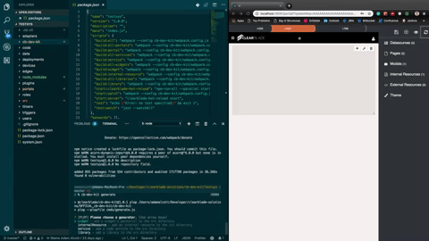
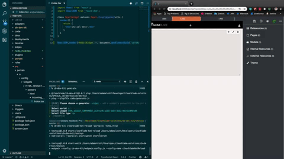

# CB Dev Kit

## Overview

CB Dev Kit provides a CLI application allowing for simpler local development of an exported ClearBlade system by providing a src directory with multiple webpack configurations to handle TypeScript and ES6 transpilation, as well as tools for unit-testing for code-based assets.

CB Dev Kit also seemlessly integrates with [ClearBlade Hot Reload](https://github.com/ClearBlade/clearblade-hot-reload) for assets that automatically transpile and update portals in real time when saved.

## Examples

Examples are located in this repo in the [examples folder](https://github.com/ClearBlade/cb-dev-kit/tree/master/examples)

## Applications

CB Dev Kit currently supports transpilation of the following asset types:

- Code Services - js and ts
- Code Libraries - js and ts
- Internal Resources (in portals) - js, ts, tsx, and jsx
- Widget Parsers (in portals) - js, ts, tsx, and jsx

## Prereqs

`ClearBlade Platform System` - A system created in a ClearBlade Platform, such as platform.clearblade.com

## Setup

1. If you haven't already, export your system to your local environment using:

- [ClearBlade Developer Console](https://docs.clearblade.com/v/4/console/) or
- [cb-cli tool](https://github.com/ClearBlade/cb-cli#export):

```
cb-cli export [-exportrows] [-exportusers]
```

2. All system assets will transferred to local development environment in their respective folders. All cb-dev-kit commands must be run from an initialized system's directory.

## Usage

### Installation

Install globally if you will be using package on multiple systems (recommended) or install locally to system directory

```
npm i -g @clearblade/cb-dev-kit
```

or

```
npm i --save-dev @clearblade/cb-dev-kit
```

### init

Initialize cb-dev-kit to create src folder, update/create your package.json with the necessary scripts and packages, install all packages, and create a cb-dev-kit directory in the system directory, which contains util functions for handling flag processing and webpack configurations.

```
cb-dev-kit init
```

#### Includes

- Src directory
  - Where all "created" assets will be stored so code can be written and then transpiled in es6, jsx, and/or typescript
  - Includes **global.d.ts** => TS definition file for adding types to Node's global interface for libraries used in Code Services and Libraries
  - Includes **setupTests.ts** => boilerplate for mocking out library calls made in Code Services and Libraries
- package.json
  - Includes start, build, and test scripts
  - Includes all packages necessary for typescript, es6, transpilation, React, and webpack compilation that will be stored node_modules directory
  - Includes babel transpilation configurations and jest testing configurations (See [Testing](#Running-Tests) section for more details)

### Asset Setup

There are two ways to set up an asset in src directory:

- [generate](#generate)- _Recommended_
- [create](#create)

#### generate

(Recommended) Launches generator to walk through setting up an asset in src directory to be accessed by webpack for transpilation, testing, or [ClearBlade Hot Reload](https://github.com/ClearBlade/clearblade-hot-reload), providing available asset names and types that are available.

##### Highlights

- No need to look up flags and asset names/IDs
- Selection of all asset types that can be created in src folder
- Selection of all specific assets for each type
- Selection of file types available for asset (js, ts, jsx, tsx)
- Prompt for auto-generating adjacent unit test file for generated file
- Prompt for auto-generating a React Component template for HTML widgets

```
cb-dev-kit generate
```



#### create

(Alternative to generate) Sets up an asset in src directory to be accessed by webpack for transpilation, testing, or [ClearBlade Hot Reload](https://github.com/ClearBlade/clearblade-hot-reload)

```
cb-dev-kit create <options>
```

| Flag             | Overview                                                                                      | Example                                                                       |
| ---------------- | --------------------------------------------------------------------------------------------- | ----------------------------------------------------------------------------- |
| portal           | Portal name                                                                                   |
| widgetId         | ID of widget, source will include all available parsers                                       | `cb-dev-kit create -portal=<portalname> -widgetId=<widgetId>`                 |
| internalResource | Name of internal resource (including extension)                                               | `cb-dev-kit create -portal=<portalname> -internalResource=<internalResource>` |
| service          | Name of service (without file extension)                                                      | `cb-dev-kit create -service=<serviceName> -type=ts`                           |
| library          | Name of library (without file extension)                                                      | `cb-dev-kit create -library=<libraryName> -type=ts`                           |
| type             | (optional) file type of new source file. Options include js, jsx, ts, and tsx. Defaults to js | `cb-dev-kit create -portal=<portalname> -widgetId=<widgetId> -type=tsx`       |
| unitTests        | (optional) set to true to include an adjacent auto-generated unit test file                   | `cb-dev-kit create -service=<serviceName> -type=ts -unitTests=true`           |

### build

Builds an asset or multiple assets from src directory into its respective directory in the system

```
cb-dev-kit build <options>
```

| Flag             | Overview                                                         | Example                                                                      |
| ---------------- | ---------------------------------------------------------------- | ---------------------------------------------------------------------------- |
| portal           | Portal name. Builds all internal resources and widgets in portal | `cb-dev-kit build -portal=<portalname>`                                      |
| widgetId         | ID of widget. Builds all parsers in widget                       | `cb-dev-kit build -portal=<portalname> -widgetId=<widgetId>`                 |
| internalResource | Name of internal resource (including extension)                  | `cb-dev-kit build -portal=<portalname> -internalResource=<internalResource>` |
| service          | Name of service (without file extension)                         | `cb-dev-kit build -service=<servicename> -type=ts`                           |
| library          | Name of library (without file extension)                         | `cb-dev-kit build -library=<libraryname> -type=ts`                           |
| all              | Builds all assets in src directory                               | `cb-dev-kit build -all`                                                      |
| all-services     | Builds all services in src directory                             | `cb-dev-kit build -all-services`                                             |
| all-libraries    | Builds all libraries in src directory                            | `cb-dev-kit build -all-libraries`                                            |
| all-portals      | Builds all portals in src directory                              | `cb-dev-kit build -all-portals`                                              |
| all-widgets      | Builds all widgets in a portal's directory                       | `cb-dev-kit build -all-widgets -portal=<portalname>`                         |

### clearblade-hot-reload

Allows any changes made to a portal inside src/ or directly in system's portal directory to update the portal in real time when the file is saved



#### Usage

1. Install globally if you will be using package on multiple systems (recommended) or install locally to system directory

```
npm i -g @clearblade/clearblade-hot-reload
```

or

```
npm i --save-dev @clearblade/clearblade-hot-reload
```

2. Initialize ClearBlade Hot Reload from within the portal by clicking the icon (displayed below) at the top right of the Dev console on the right side. A success notification should display, else check the console for information on any errors.


3. Initialize the hot reload server from the local system directory.\

```
cb-dev-kit clearblade-hot-reload start
```

| Flag        | Overview                                                                                                                                         | Example                  |
| ----------- | ------------------------------------------------------------------------------------------------------------------------------------------------ | ------------------------ |
| portal      | Portal name                                                                                                                                      | -portal=\<portalName>    |
| messagePort | Should be set to the same -messagePort the console is running on. Defaults to 1883.                                                              | -messagePort=1884        |
| noSSL       | Disables SSL for non-TLS connections on local systems. If on a production system with TLS enabled, ignore this flag and set -messagePort to 1884 | -noSSL=true              |
| caPath      | If pointing at a production system and your certificate authority is not DigiCert, you must use -caPath to provide the absolute path of your CA. | -caPath=/\*/\*/\*/ca.pem |

## Running Tests

### Configuration

- `cb-dev-kit init` will automatically install jest and provide the jest configuration in your system's package.json to check the src directory for test files, including babel configurations for jsx and tsx files

- `cb-dev-kit init` will also automatically create a setupTests.ts file in src that provides a boilerplate for mocking out global objects for libraries to be used in code services and libraries

### Running tests

- All tests in the src directory can be run with `npm run test`
